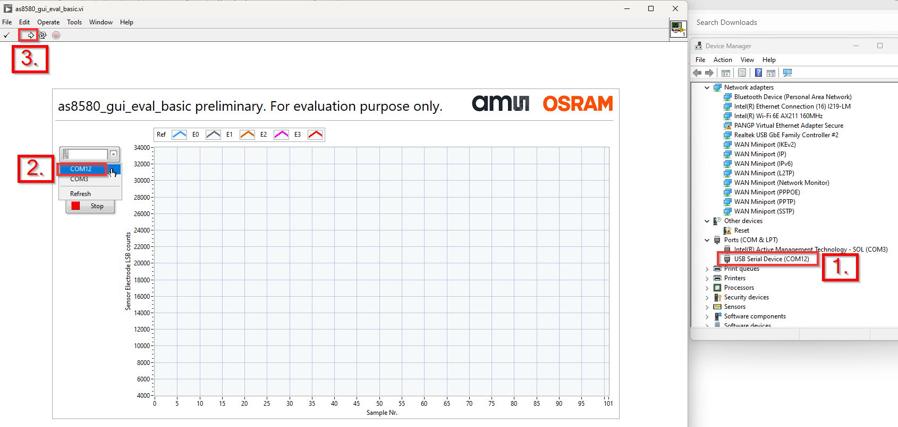
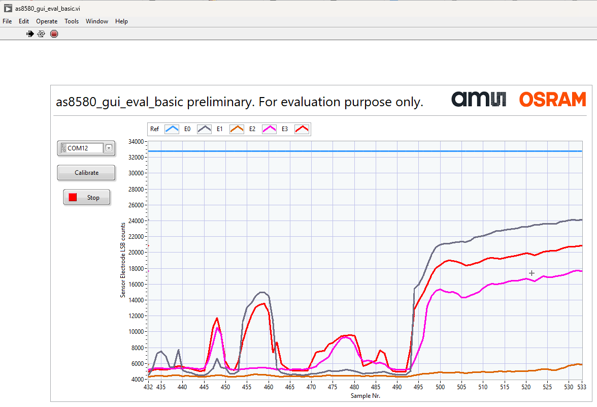

## Overview
Items in this folder provide the software components which can be used in conjunction of the AS8580 evaluation kit for a basic evaluation of AS8580 capacitive sensor chip.

## Getting started

1. Update firmware of your Raspberry Pi Pico with [Firmware for Raspberry Pi Pico](https://github.com/ams-OSRAM-Group/as8580_capacitive_sensor_test/blob/main/eval_basic/fw/build/as8580_fw_eval_basic.uf2) .uf2-file. 

    How to update firmware based on an uf2-file is explained at chapter 3.2 in [here](https://datasheets.raspberrypi.com/pico/getting-started-with-pico.pdf).

2. Install GUI for interacting with AS8580 evaluation kit

    2.1 Download and install NI LabVIEW Runtime Version 2024 Q3 64bit [here](https://www.ni.com/en/support/downloads/software-products/download.labview-runtime.html#show-offline-installers). (Install with default options)

    2.2 Download and install NI-VISA 2024 Q3 [here](https://www.ni.com/en/support/downloads/drivers/download.ni-visa.html#show-offline-installers). (Install with default options)

    2.3 Download and open evaluation software [here](https://github.com/ams-OSRAM-Group/as8580_capacitive_sensor_test/blob/main/eval_basic/ui_dep/as8580_gui_eval_basic.exe)

## How to use

1. Connect the Raspberry Pi Pico via USB to your host PC.

2. Open [this](https://github.com/ams-OSRAM-Group/as8580_capacitive_sensor_test/blob/main/eval_basic/ui_dep/as8580_gui_eval_basic.exe) exe-file from your host PC. Then you shoud see the GUI.

3. Determine to which COM Port the Raspberry Pi Pico is connected to. E.g. via the "Device Manager"

4. Select the according COM Port in the GUI.

5. Press the "Run" button in the GUI.

6. You should now see a continious measurement running. You can verify that by touching the sense electrodes: 

